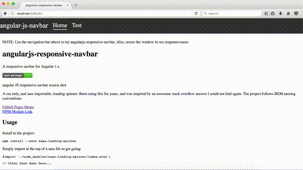

# angularjs-responsive-navbar

[](https://badge.fury.io/js/angularjs-responsive-navbar)



[Github Pages Demo](https://torch2424.github.io/angularjs-responsive-navbar/).
[NPM Module Link](https://www.npmjs.com/package/angularjs-responsive-navbar).

A responsive navbar for Angular 1.x. Requires [Angular ui-router](https://github.com/angular-ui/ui-router), and uses flexbox. Should be compatible with IE 10+, and all major browsers. Currently, the project has no tests. Though, the [Github Pages Demo](https://torch2424.github.io/angularjs-responsive-navbar/) can be used for manual testing of the latest master.

## Usage

**Install to the project:**

```
npm install --save angularjs-responsive-navbar
```

**Add the following to the project:**

**index.html**
```html
<head>
  <!-- Angular JS -->
  <script src="https://cdnjs.cloudflare.com/ajax/libs/angular.js/1.6.5/angular.js" type="text/javascript">
  </script>
  <!-- Angular ui-router -->
  <script src="https://cdnjs.cloudflare.com/ajax/libs/angular-ui-router/1.0.3/angular-ui-router.js" type="text/javascript">
  </script>
  <!-- angularjs-responsive-navbar -->
  <script src="node_modules/angularjs-responsive-navbar/bin/angularJSNavbar.js" type="text/javascript">
  </script>

  <!-- Your JS here... -->
  <script src="./index.js" type="text/javascript">
  </script>


  <!-- angularjs-responsive-navbar CSS -->
  <link rel="stylesheet" href="node_modules/angularjs-responsive-navbar/bin/angularJSNavbar.css" type="text/css">


  <!-- Your CSS here... -->
  <link rel="stylesheet" href="./index.css" type="text/css">

</head>
<body>
  <!-- The angularjs-responsive-navbar component -->
  <angular-js-navbar></angular-js-navbar>

  <!-- Your application HTML Here -->

</body>
```

**index.js (Or whever your angular app is bootstrapped)**
```javascript
const app = angular.module(/* YOUR MODULE NAME */, ['angularJSNavbar', 'ui.router' /* YOUR OTHER IMPORTED MODULES*/]);
app.config($stateProvider => {
  /* Define your ui-router states here */
  const homeState = {
    name: 'home',
    url: '/',
    templateUrl: './README.html'
  }

  const testState = {
    name: 'test',
    url: '/test',
    template: '<h3>I am the test route!</h3>'
  }

  $stateProvider.state(homeState);
  $stateProvider.state(testState);
});
app.run((navbarRouteService) => {

  // Set your site title
  navbarRouteService.setTitle('angular-js-navbar', {
    title: 'Home',
    state: 'home',
    url: '/'
  });

  // Set your application routes, should be similar to defined ui-router states
  navbarRouteService.setRoutes([{
    title: 'Home',
    state: 'home',
    url: '/'
  },
  {
    title: 'Test',
    state: 'test',
    url: '/test'
  }]);
});
```

Please see the [docs/](./docs) folder to see how the project is utilized in a simple static project.

## Services API

#### navbarRouteService:

**Objects:**

`{route}` objects are defined as:

```json
{
  "title": "The string to be displayed on the navbar",
  "state": "the ui-router state to link to",
  "url": "the url to navigate to"
}
```

**Methods:**

`setTitle('string', {route})` - Sets the displayed title on the navbar. Optional second argument will make the title link to the passed route object.

`setRoutes([{route}])` - Sets the routes that are displayed in the navbar. Accepts an array of route objects.

`getRoutes()` - Returns the currently set routes in the navbar

`enableAlwaysMobile()` - Sets the navbar to always show the mobile layout

`enableAlwaysDesktop` - Sets the navbar to always show the desktop layout

## Contributing

Clone the project:

```
git clone https://github.com/torch2424/angularjs-responsive-navbar.git
```

Install devDependencies:

```
npm install
```

Host the project at [localhost:8080](http://localhost:8080), livereload, and watch for changes:

```
npm run start
```

Build the project with:

```
npm run build
```

## LICENSE

[MIT](https://choosealicense.com/licenses/mit/#)
